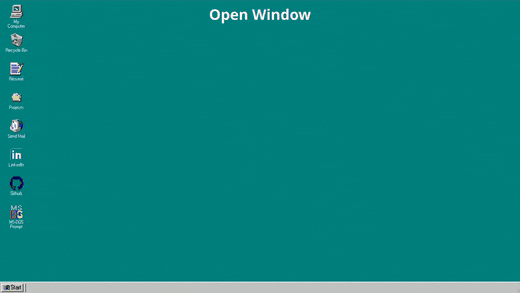

# [Windows 95 themed portfolio](https://d-najd.github.io/portfolio/)

Web based windows 95 desktop recreation

---

## Features

### Window Management

* Windows can be opened by double-clicking an icon (some icons redirect to other
  webpages like GitHub or LinkedIn)
* Windows can be moved around and resized like real windows
* Window Action buttons (minimizing, maximizing, closing) are functional



### Bottom Bar

* Opened windows will be added here
* Start menu contains list of quick actions


### Resume Window

* Contains my resume which can be viewed inside the window itself
* The resume can be downloaded or opened in another tab

### Send Mail Window

* Mail can be sent to me by pressing the send mail icon. The mail will include
  the entered description and subject and uses the mailing application on your
  pc
* Has near identical styling to one of windows 95's mailing applications

### Projects Window

* Contains list of projects that I have worked on

---

## Technologies Used

- React
- Redux
- Vite
- Styled Components
- Prettier
- GitHub Pages
- Typescript

---

## Contact Me

### [Email Me](mailto:dimitar.najdovskiw@gmail.com)

---

## Project Setup

1. Git clone the project

```shell
git clone https://github.com/d-najd/portfolio.git
```

2. Install packages

```shell
npm install
```

3. Run the project

```shell
npm start
```
